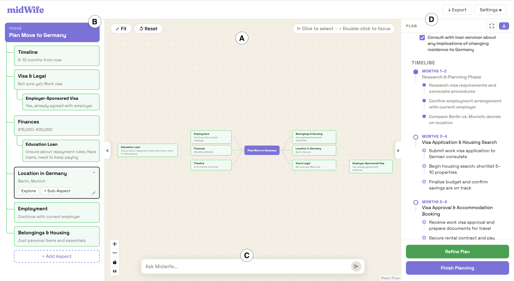
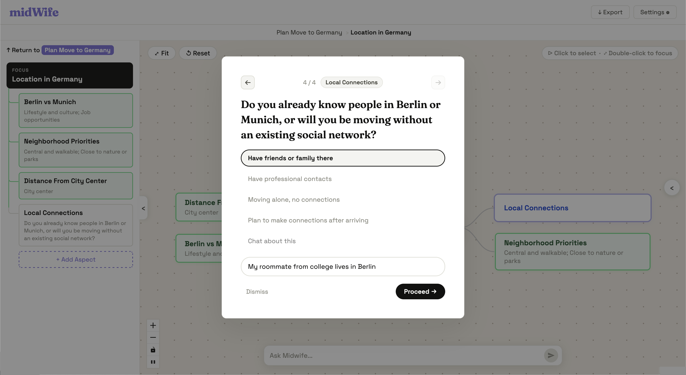
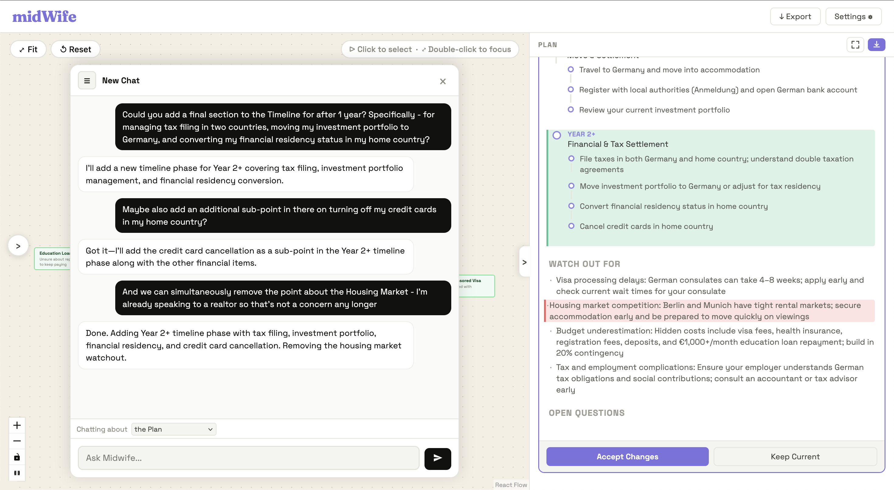

# midWife

> *Transform ideas into action through Socratic dialogue.*

[](LICENSE)




---

## About

midWife is an LLM-powered planning tool that uses the **Socratic Method** to help users think through complex, open-ended decisions. Rather than generating a complete plan upfront, it asks focused questions that drive the growth of a navigable **Discourse Tree** — then synthesises the tree into an actionable Plan.

The name is a tribute to Plato's concept of *maieutics*: just as a midwife helps give birth to children, Socrates described his method as helping others give birth to wisdom. midWife plays the same role — not supplying answers, but drawing them out.

---

## Features

- **Discourse Tree** — your planning objective (Thesis) sits at the centre of a radial node-link diagram; AI-generated Aspects branch outward as you explore
- **9 Planning Modes** — Logistics, Brainstorm, Creative, Problem-Solving, Decision, Research, Reflect, Set Goals, Learn — each with a distinct questioning strategy
- **Interview Flow** — one-at-a-time Socratic questions with suggestion chips, free-text answers, and an optional per-node chat assistant
- **Navigator Pane** — structured list view with a Focus Node for deep-diving into subtrees; supports add, edit, move, delete, and AI-powered Explore
- **Plan Pane** — a synthesised Markdown plan derived from the full discourse; edits are proposed as a diff preview that you accept or reject
- **Mixed-initiative** — every significant action can be initiated by either the user or the AI
- **Persistent sessions** — up to 20 sessions stored locally, fully resumable

---

## Screenshots

| Interview Flow | Plan Refinement |
|---|---|
|  |  |

---

## Tech Stack

| Layer | Technology |
|-------|------------|
| Frontend | React 19, Vite, ReactFlow, Dagre |
| Backend | FastAPI, Uvicorn |
| Primary LLM | Claude Haiku 4.5 (Anthropic) |
| Fallback LLM | Gemini 2.0 / 2.5 Flash (Google) |

---

## Prerequisites

- Python 3.13+
- Node.js 18+
- An [Anthropic API key](https://console.anthropic.com/)
- A [Google Gemini API key](https://aistudio.google.com/app/apikey)

---

## Setup & Running

**1. Clone the repo**
```bash
git clone https://github.com/adityashukzy/midwife.git
cd midwife
```

**2. Configure environment variables**
```bash
cp .env.example .env
# Open .env and fill in your ANTHROPIC_API_KEY and GEMINI_API_KEY
```

**3. Start the backend**
```bash
pip install -e .
uvicorn backend.main:app --reload
```

**4. Start the frontend** (new terminal)
```bash
cd frontend
npm install
npm run dev
```

Open [http://localhost:5173](http://localhost:5173).

---

## Paper

A full system paper is available at [`docs/project_report/midwife.pdf`](docs/project_report/midwife.pdf).

---

## License

midWife is licensed under the **GNU Affero General Public License v3.0** for open and non-commercial use — see [`LICENSE`](LICENSE) for details.

For commercial licensing enquiries, contact [adshukla@cs.toronto.edu](mailto:adshukla@cs.toronto.edu).
